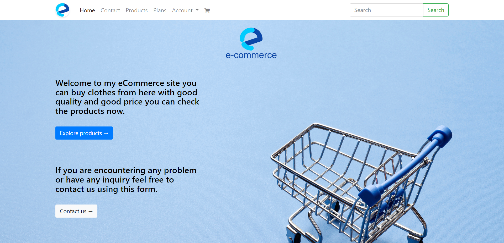
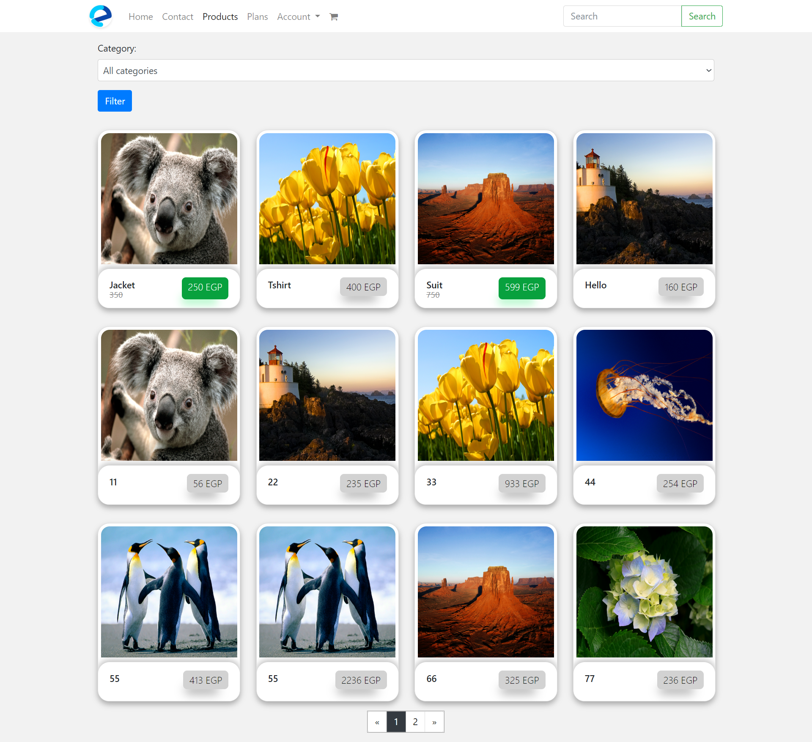
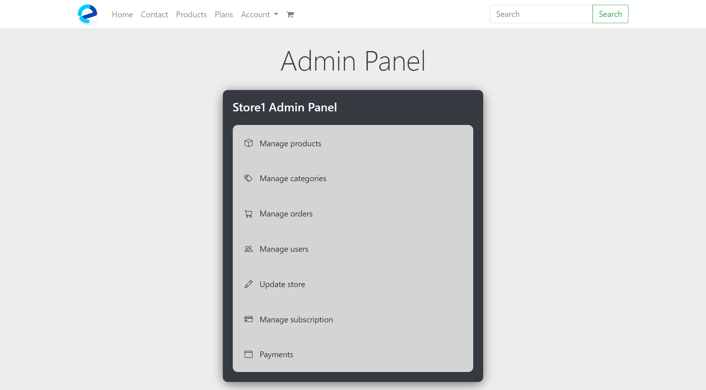
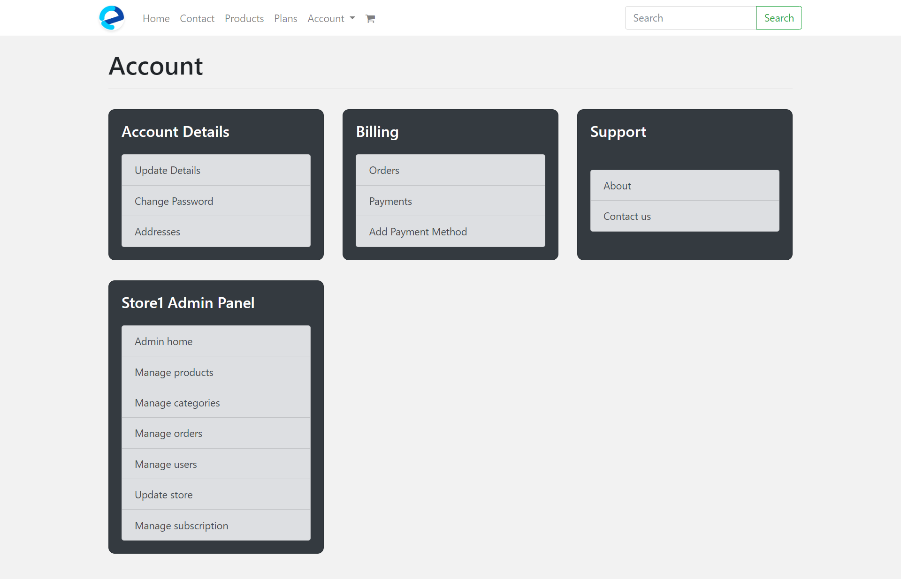
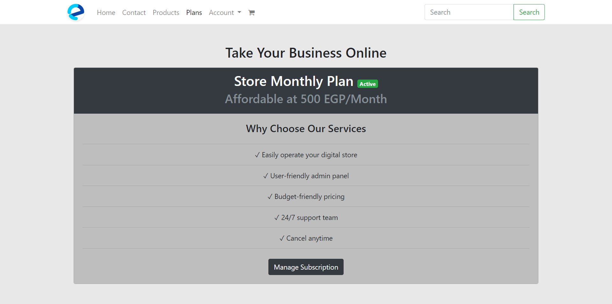
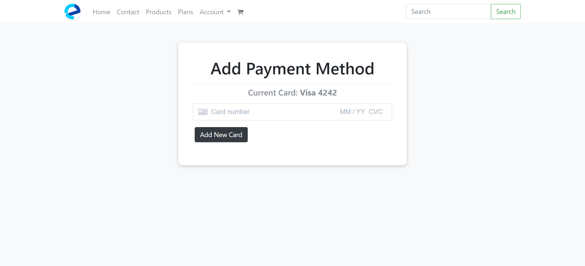
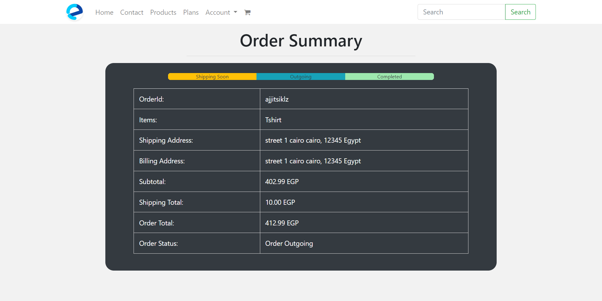
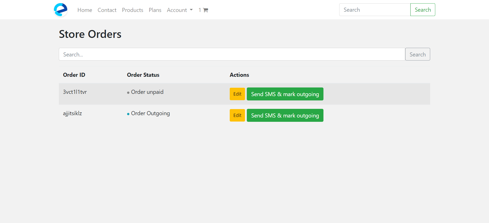
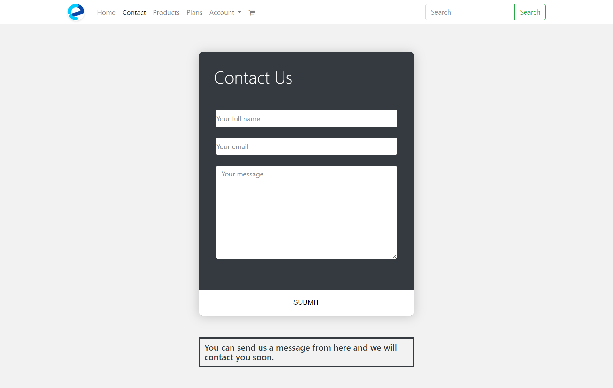

<div align="center">

  

  # eCommerce SaaS Platform

  **Multi-Tenant Django eCommerce with Stripe Subscriptions & Store Admin Panel**

  [](https://www.python.org/)
  [](https://www.djangoproject.com/)
  [](https://stripe.com/)
  [](https://getbootstrap.com/)
  [](https://heroku.com/)

</div>

---

A full-stack, multi-tenant SaaS eCommerce platform built with Django 4.1. Store owners subscribe to create and manage their own online shop — with product management, order tracking, team access, and customer checkout all under one platform. Payments are handled end-to-end by Stripe.

> **⚠️ Confidentiality Notice**
> **Source code repository is private due to client confidentiality.**
> This document serves as a technical case study, showcasing architecture, UX implementation, and feature engineering for portfolio purposes.

---

## Visual Showcase

### Homepage — Store Product Listing



*Full product listing page with search, category filtering, and product cards. Powered by a custom ProductManager with queryset-level search across title, description, price, and tags.*

---

### Products View



*Product grid view with featured products surfaced at the top. Each product is store-scoped — product visibility is tied to the owning store's subscription status.*

---

### Store Admin Panel



*The store owner's admin panel — a custom-built dashboard separate from Django admin. Manages products, categories, orders, team members, and store settings from a single interface.*

---

### Account — Store Owner View



*Authenticated store owner view with subscription status, store management links, and team access controls.*

---

### Buy a Store — SaaS Subscription Flow



*Store creation and Stripe subscription purchase flow. New stores are locked until subscription payment is confirmed; status tracks across `active`, `canceled`, `payment_failed`, and `expired`.*

---

### Stripe — Change Payment Method



*Customer card management powered by the Stripe API. Cards are stored as Stripe source objects; the default card is automatically unset when a new default is added — via a `post_save` signal.*

---

### Order Summary & Details



*Checkout order summary with itemized cart, shipping total, and final amount. Totals recalculate automatically through Django signals whenever the cart or shipping changes.*

---

### Orders — Store Admin View



*Store admin order management — lists all customer orders for the store with status tracking and SMS/email notification triggers on status changes.*

---

### Contact Page



*Contact form with AJAX submission and Gmail SMTP delivery.*

---

## Key Features & Technical Implementation

### 1. Multi-Tenant Store Architecture

Each store is an isolated tenant — products, orders, categories, and team members are all scoped to their owning store via ForeignKey. A Stripe subscription governs access: if a store's subscription lapses, its products stop appearing to customers.

```python
# stores/models.py
class Store(models.Model):
    STATUS_CHOICES = [
        ('active', 'Active'),
        ('canceled', 'Canceled'),
        ('refunded', 'Refunded'),
        ('payment_failed', 'Payment Failed'),
        ('expired', 'Expired'),
    ]
    name                = models.CharField(max_length=255, unique=True)
    owner               = models.OneToOneField(User, on_delete=models.CASCADE)
    users               = models.ManyToManyField(User, related_name='store_users')
    logo                = models.ImageField(upload_to='store_logos/')
    subscription_status = models.CharField(max_length=255, choices=STATUS_CHOICES)
    subscription_id     = models.CharField(max_length=255)
    subscription_start  = models.DateTimeField(null=True)
    subscription_expiry = models.DateTimeField(null=True)
```

Store team members are managed as a ManyToMany relationship — the owner can add/remove users from the store's admin panel without touching Django's built-in permission system.

---

### 2. Stripe Payment Integration

The billing layer manages three connected Stripe objects: **Customer**, **Card**, and **Charge**. A `BillingProfile` is automatically created for every new user (and every guest checkout) via a `post_save` signal; the Stripe customer is created in `pre_save` the moment the profile gains an email address.

```python
# billing/models.py — auto-create Stripe customer on BillingProfile save
def billing_profile_created_receiver(sender, instance, *args, **kwargs):
    if not instance.customer_id and instance.email:
        customer = stripe.Customer.create(email=instance.email)
        instance.customer_id = customer.id

pre_save.connect(billing_profile_created_receiver, sender=BillingProfile)
```

Charges are executed through a `ChargeManager` that pulls the default card, calls `stripe.Charge.create`, stores the full outcome (type, seller message, risk level), and returns a `(paid, message)` tuple to the checkout view:

```python
# billing/models.py — ChargeManager.do()
def do(self, billing_profile, order_obj, card=None):
    c = stripe.Charge.create(
        amount      = int(order_obj.total * 100),  # EGP, in piastres
        currency    = "egp",
        customer    = billing_profile.customer_id,
        source      = card_obj.stripe_id,
        description = f'OrderID: {order_obj.order_id}',
        metadata    = {"order_id": order_obj.order_id},
    )
    new_charge_obj = self.model(
        billing_profile = billing_profile,
        stripe_id       = c.id,
        paid            = c.paid,
        refunded        = c.refunded,
        outcome         = c.outcome,
        outcome_type    = c.outcome['type'],
        seller_message  = c.outcome.get('seller_message'),
        risk_level      = c.outcome.get('risk_level'),
    )
    new_charge_obj.save()
    return new_charge_obj.paid, new_charge_obj.seller_message
```

A `post_save` signal on `Card` ensures only one card is ever the default — when a new default is set, all others are deactivated in a single `qs.update(default=False)` call.

---

### 3. Session-Based Cart with Auto-Tax

Carts work for both authenticated users and unauthenticated guests via session. On login, an anonymous session cart is adopted by the user automatically.

```python
# carts/models.py — CartManager.new_or_get()
def new_or_get(self, request):
    cart_id = request.session.get("cart_id", None)
    qs = self.get_queryset().filter(id=cart_id)
    if qs.count() == 1:
        cart_obj = qs.first()
        if request.user.is_authenticated and cart_obj.user is None:
            cart_obj.user = request.user  # adopt anonymous cart on login
            cart_obj.save()
    else:
        cart_obj = Cart.objects.new(user=request.user)
        request.session['cart_id'] = cart_obj.id
    return cart_obj, new_obj
```

Tax is applied automatically through Django signals — `m2m_changed` recalculates the subtotal when any product is added or removed; `pre_save` applies the configured tax multiplier before every write:

```python
# carts/models.py — tax applied via pre_save signal
def pre_save_cart_receiver(sender, instance, *args, **kwargs):
    if instance.subtotal > 0:
        instance.total = Decimal(instance.subtotal) * Decimal(settings.TAX_AMOUNT)
    else:
        instance.total = 0.00

pre_save.connect(pre_save_cart_receiver, sender=Cart)
```

---

### 4. Order Lifecycle & Auto-Total Calculation

Orders move through a defined status chain: `created → paid → outgoing → completed → refunded`. Totals recalculate through a `post_save` signal on `Cart` — whenever the cart changes, any associated order automatically re-runs `update_total()`.

```python
# orders/models.py — Order status lifecycle
ORDER_STATUS_CHOICES = (
    ('created',   'Created'),
    ('paid',      'Paid'),
    ('outgoing',  'Outgoing'),
    ('completed', 'Completed'),
    ('refunded',  'Refunded'),
)

def update_total(self):
    cart_total = self.cart.total
    new_total = math.fsum([cart_total, self.shipping_total])
    self.total = format(new_total, '.2f')
    self.save()

def check_done(self):
    return all([
        self.billing_profile,
        self.shipping_address,
        self.billing_address,
        self.total > 0,
    ])

def mark_paid(self):
    if self.check_done():
        self.status = "paid"
        self.save()
    return self.status
```

Order IDs are auto-generated as random unique alphanumeric strings via a `pre_save` signal, so customers never see sequential database IDs.

---

### 5. Custom AbstractBaseUser with Email Verification

The authentication system uses `AbstractBaseUser` with email as the primary identifier (no username field). Phone number validation enforces Egyptian mobile format via regex.

```python
# accounts/models.py — Custom User
def validate_phone_number(value):
    if not re.match(r'^01\d{9}$', value):
        raise ValidationError('Invalid phone number')

class User(AbstractBaseUser):
    email        = models.EmailField(max_length=255, unique=True)
    full_name    = models.CharField(max_length=255, blank=True, null=True)
    phone_number = models.CharField(validators=[validate_phone_number], max_length=11)
    is_active    = models.BooleanField(default=True)
    staff        = models.BooleanField(default=False)
    admin        = models.BooleanField(default=False)
    customer_id  = models.CharField(max_length=255, blank=True, null=True)  # Stripe

    USERNAME_FIELD  = 'email'
    REQUIRED_FIELDS = []
```

Email verification uses a time-windowed `EmailActivation` model. The key is generated in `pre_save`, the activation email is sent in `post_save` on user creation. Keys expire after 7 days — the `confirmable()` queryset method enforces this at the ORM level:

```python
# accounts/models.py — time-windowed activation queryset
class EmailActivationQuerySet(models.query.QuerySet):
    def confirmable(self):
        now = timezone.now()
        return self.filter(
            activated=False,
            forced_expired=False,
            timestamp__gt=now - timedelta(days=DEFAULT_ACTIVATION_DAYS),
            timestamp__lte=now,
        )
```

---

## Tech Stack

<div align="center">

| Layer | Technology |
|---|---|
| **Backend** | Python 3, Django 4.1 |
| **Database** | SQLite3 (dev) · PostgreSQL via psycopg2 (prod) |
| **Payments** | Stripe API — Customer, Card, Charge, Subscription |
| **SMS Notifications** | Twilio |
| **Email** | Gmail SMTP · Django email templates |
| **Frontend** | Bootstrap 5, jQuery, AJAX |
| **Static Files** | Whitenoise |
| **Media Storage** | Local (Pillow) |
| **WSGI Server** | Gunicorn |
| **Deployment** | Heroku (django-heroku) |

</div>

<br/>


---

## Application Structure

```
src/
├── ecommerce/          # Project settings, root URLs, contact form, utilities
├── accounts/           # Custom AbstractBaseUser, email verification, guest checkout
├── stores/             # Multi-tenant store model, subscription lifecycle
├── store_admin/        # Store owner dashboard — product/order/user management
├── products/           # Product model, custom manager, search, 4-image support
├── carts/              # Session & auth cart, tax via signals
├── orders/             # Order lifecycle, auto-total recalculation
├── billing/            # Stripe BillingProfile, Card, Charge models
├── addresses/          # Shipping & billing address management
├── categories/         # Store-scoped product categories
├── analytics/          # Product view tracking (ObjectViewed)
├── search/             # Full-text product search
└── tags/               # Product tagging system
```

---

## Deployment

Configured for Heroku via `django-heroku`:

| Detail | Value |
|---|---|
| **WSGI** | Gunicorn |
| **Static files** | Whitenoise |
| **Database** | PostgreSQL (production settings) |
| **Settings split** | `settings/base.py` · `settings/local.py` · `settings/production.py` |
| **Platform** | Heroku |

```bash
pip install -r src/requirements.txt
cd src
python manage.py migrate
python manage.py collectstatic
gunicorn ecommerce.wsgi
```

---

## About the Developer

Independently designed, architected, and built — from data model design and Stripe integration through to multi-tenant store isolation and the custom store admin panel.

> Available for full-stack Django projects, SaaS platforms, and payment-integrated web applications.

[](https://www.linkedin.com/in/mosayed-dev/)
[](mailto:mypc10080@gmail.com)

---

<div align="center">
  <sub>Django 4.1 · Multi-Tenant SaaS · Stripe Payments · Full-Stack eCommerce Platform</sub>
</div>
